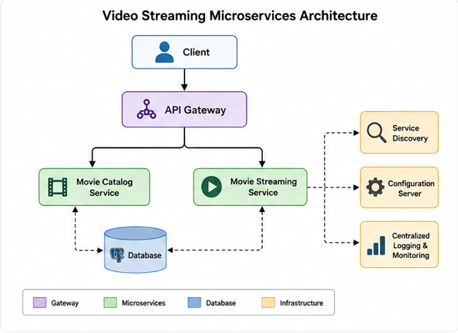

# 🎬 Video Streaming Platform

A **microservices-based video streaming platform** designed to provide scalable, modular, and reliable video content management and streaming.

---

## 📌 Overview

The **Video Streaming Platform** is built using a **microservices architecture**, where each major functionality is developed and deployed as an independent service.

The project demonstrates:

🔹 Microservices Architecture
🔹 Service Discovery
🔹 API Gateway
🔹 Centralized Configuration
🔹 RESTful APIs
🔹 Inter-Service Communication
🔹 Video Catalog Management
🔹 Video Streaming
🔹 Fault Tolerance
🔹 Containerized Deployment

---

## 🏗️ Architecture



---

## 🚀 Features

### 🎥 Video Catalog

🔹 Add video/movie information
🔹 Retrieve movie details
🔹 Browse available movies
🔹 Search movies
🔹 Manage movie metadata

### ▶️ Video Streaming

🔹 Stream video content
🔹 Handle video streaming requests
🔹 Support large video files
🔹 Efficient content delivery

### 🌐 API Gateway

🔹 Single entry point for clients
🔹 Request routing
🔹 Service abstraction
🔹 Centralized API access

### 🔍 Service Discovery

🔹 Dynamic service registration
🔹 Service lookup
🔹 Load-balanced communication between services

### ⚙️ Centralized Configuration

🔹 Externalized application configuration
🔹 Environment-specific configurations
🔹 Centralized configuration management

---

## 🧩 Microservices

| Service                   | Responsibility                                 |
| ------------------------- | ---------------------------------------------- |
| `api-gateway`             | Routes client requests to appropriate services |
| `service-registry`       | Registers and discovers microservices          |
| `config-server`           | Provides centralized configuration             |
| `movie-catalog-service`   | Manages movie/video metadata                   |
| `video-streaming-service` | Handles video streaming                        |
| `database`                | Stores application data                        |

---

## 🛠️ Tech Stack

### Backend

🔹 ☕ Java
🔹 🌱 Spring Boot
🔹 ☁️ Spring Cloud
🔹 🔗 REST APIs
🔹 📡 Microservices

### Infrastructure

🔹 🔍 Service Discovery
🔹 🚪 API Gateway
🔹 ⚙️ Config Server
🔹 🐳 Docker
🔹 🔄 CI/CD

### Database

🔹 🗄️ PostgreSQL / MySQL

### Development Tools

🔹 🐙 Git
🔹 📮 Postman
🔹 🧰 Maven
🔹 💻 IntelliJ IDEA / Eclipse

---

## 📂 Project Structure

```text
video-streaming-platform/
│
├── api-gateway/
│
├── service-discovery/
│
├── config-server/
│
├── movie-catalog-service/
│
├── video-streaming-service/
│
├── Config/
│
└── README.md
```

---

## 🔄 Request Flow

```text
Client
   │
   ▼
API Gateway
   │
   ▼
Service Discovery
   │
   ├──────────────► Movie Catalog Service
   │
   └──────────────► Video Streaming Service
                         │
                         ▼
                      Storage
```

---

## 🔌 API Endpoints

### Movie Catalog

| Method   | Endpoint       | Description     |
| -------- | -------------- | --------------- |
| `POST`    | `/movie-info/save`      | Saves all movies from Store  |
| `GET`    | `/movie-info/lists` | Get all movies |
| `GET`   | `/movie-info/find-by-id/{movieIndoId}`      | Get movie by ID     |

### Movie Streaming

| Method | Endpoint              | Description           |
| ------ | --------------------- | --------------------- |
| `GET`  | `/movie-stream/{videoPath}` | Stream video          |
| `GET`  | `movie-stream/with-id/{movieInfoId}`        | Get video information |


---

## ⚙️ Configuration

Configuration is managed using the centralized configuration service.

Example:

```yaml
server:
  port: 8080

spring:
  application:
    name: movie-catalog-service
```

---

## ▶️ Getting Started

### Prerequisites

Make sure the following are installed:

🔹 Java 21+
🔹 Maven
🔹 Git
🔹 Docker *(optional)*
🔹 PostgreSQL / MySQL

### Clone the Repository

```bash
git clone https://github.com/Vansh-829/Video-Streaming-App.git
cd video-streaming-platform
```

### Build the Project

```bash
mvn clean install
```

### Run the Services

Start the services in the following order:

```text
1. Config Server
2. Service Discovery
3. API Gateway
4. Movie Catalog Service
5. Video Streaming Service
```

<!-- ---

## 🐳 Docker

Build the Docker images:

```bash
docker build -t video-streaming-platform .
```

Run the application:

```bash
docker-compose up
```

> Docker configuration can be added according to the deployment setup. -->

---

<!-- ## 🧪 Testing

The project can be tested using:

🔹 JUnit
🔹 Mockito
🔹 Spring Boot Test
🔹 Postman

Example:

```bash
mvn test
```

--- -->

## 📊 Monitoring & Observability

The platform can be extended with:

🔹 Spring Boot Actuator
🔹 Application logging
🔹 Distributed tracing
🔹 Metrics
🔹 Centralized log management

---

## 🔐 Security

Potential security features include:

🔹 Authentication
🔹 Authorization
🔹 JWT-based security
🔹 API endpoint protection
🔹 Secure service-to-service communication

---

## 🚀 Future Enhancements

* [ ] User authentication
* [ ] User profiles
* [ ] Watch history
* [ ] Recommendations
* [ ] Video upload
* [ ] Video transcoding
* [ ] Redis caching
* [ ] Kafka-based event processing
* [ ] Rate limiting
* [ ] Distributed tracing
* [ ] Kubernetes deployment
* [ ] CI/CD pipeline

---

## 📸 Screenshots

Add application screenshots here.

```text
screenshots/
├── home.png
├── movie-details.png
├── streaming.png
└── architecture.png
```

---

## 🎯 Learning Objectives

This project demonstrates practical implementation of:

🔹 Microservices architecture
🔹 Spring Boot
🔹 Spring Cloud
🔹 API Gateway
🔹 Service Discovery
🔹 Centralized Configuration
🔹 REST API development
🔹 Database integration
🔹 Inter-service communication
🔹 Containerization
🔹 Scalable backend design

---

## 👨‍💻 Author

**Vansh Gala**

🔹 💼 [LinkedIn](https://linkedin.com/in/vansh-gala)
🔹 🐙 [GitHub](https://github.com/Vansh-829)
🔹 📧 [Email](mailto:vansh.gala2024@gmail.com)

---

## ⭐ Support

If you find this project useful, consider giving it a ⭐ on GitHub.
